  

<h1 align="center">Hi 👋, I'm Boopathi Rajamani</h1>
<h3 align="center">
AI & Data Science Student | Full-Stack Developer | Frontend Developer | QA Tester
</h3>

  

💡 Building AI-powered applications that solve real-world problems.

---

## 🚀 About Me

- 🎓 B.Tech Artificial Intelligence & Data Science Student
- 💼 Frontend Developer & QA Tester Intern
- 🌱 Currently learning **Java, DSA, Backend Development**
- 🤖 Interested in AI, Machine Learning and Full-Stack Development
- 🚀 Building modern applications with React, Node.js and MongoDB
- ⚡ Love solving real-world problems through technology

---

---

# 💻 Tech Stack

  

---

# 🌱 Currently Working On

- ☕ Java & Data Structures & Algorithms
- 🚀 Full-Stack MERN Applications
- 🤖 Artificial Intelligence & Machine Learning
- 🌍 Open Source Learning
- 📈 Strengthening Problem Solving Skills

---

---

# 🚀 Featured Projects

<table>
<tr>
<td width="50%">

### 🤖 AI Tutor

An AI-powered learning platform that helps students learn through interactive AI-driven educational experiences.

**🛠 Tech Stack**

React • JavaScript • Vite • AI

</td>

<td width="50%">

### 🔗 AI URL Shortener

A modern URL shortening platform with analytics, QR code generation and responsive UI.

**🛠 Tech Stack**

React • Node.js • MongoDB

</td>
</tr>

<tr>

<td width="50%">

### 🌐 Personal Portfolio

My personal developer portfolio showcasing my projects, technical skills and achievements.

**🛠 Tech Stack**

React • JavaScript • Vite

</td>

<td width="50%">

### 🏥 Dotzza

Contributed as a **Frontend Developer & QA Tester Intern**, working on UI pages, testing, debugging, and improving application quality during my internship.

**🛠 Contribution**

React • QA Testing • UI Development

</td>

</tr>

</table>

---

# 📊 GitHub Activity

---

# 🐍 Contribution Snake

  

---

# 💼 Experience

### 🚀 Frontend Developer & QA Tester Intern
**SeeDataMD Pvt. Ltd.** *(Sep 2025 – Apr 2026)*

> 💻 Developed responsive frontend components.
>
> 🧪 Performed functional, UI & regression testing.
>
> 🤝 Collaborated with developers to improve user experience.
>
> 🐞 Validated bug fixes and ensured release quality.

---

# 🏅 Certifications

---
---

# 💻 Developer Workspace

  

 

# 🤝 Let's Connect

 

## ⭐ Thanks for Visiting!

### *"Building intelligent solutions, one commit at a time."*

### 🤖 AI • ☕ Java • ⚛️ Full Stack Development

### 🚀 See you in the next commit!

---
